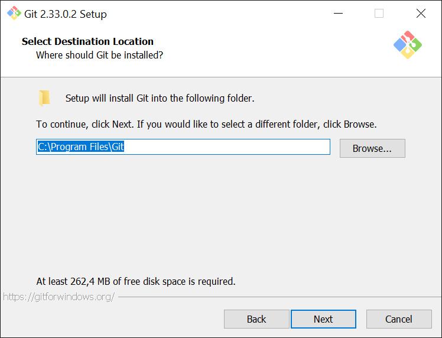

# Instalasi Git

[**Halaman Awal**](README.md)

Cara Instalasi Git di sistem operasi **Windows** :

Ada beberapa pilihan teks editor untuk Git itu sendiri, seperti notepad++. vim, VsCode. Saya menggunakan teks editor VsCode sebagai teks editor bawaan default dari Git itu sendiri (_akan digunakan pada langkah ke-5_).

**Langkah Instalasi :**

1. Klik dua kali pada file instalasi / .exe dari git tersebut.


2. Memilih direktori atau folder yang akan menjadi tempat instalasi dari file git tersebut, namun pengaturan bawaan dari git menyarankan untuk menginstal di **C:\Program Files\Git**.



3. Memilih komponen apa saja akan di install, ada fitur baru dari git versi 2.33.0 yaitu bisa menambah Git Bash ke Terminal Windows (Optional).


4. Memilih folder untuk menempatkan Git pada start menu (_windows logo_).


5. Memilih Teks editor yang akan digunakan.


6. Mengatur nama dari branch/cabang pada saat membuat repositori baru, terdapat dua pilihan yaitu ingin tetap menggunakan **_master_** sebagai nama branch utam, atau memilih pilihan kedua untuk menggunakan nama custom, yang mana dari git tersebut merekomendasikan _**main**_ sebagai nama dari branch utama.
  > Banyak tim sudah mengganti nama default dari branch mereka dengan "main", "trunk", dan "development".


7. Pada saat instalasi, Git menyediakan akses git melalui Bash maupun command prompt. Pilih pilihan kedua supaya bisa menggunakan dari dua antarmuka tersebut. Bash adalah shell di Linux. Dengan menggunakan bash di Windows, pekerjaan di command line Windows bisa dilakukan menggunakan bash - termasuk ekskusi dari Git.


8. memeilih secure shell yang akan digunakan GIt, usahakan tidak usah diganti.


9. Memilih SSL/TLS Library untuk koneksi HTTPS


10. memilih pilihan pertama untuk konversi akhir baris (CR-LF).


11. Mengatur terminal emulator apa yang akan digunakan oleh git bash, pilih yang MinTTY saja.


12. memilih apa yang akan dilakukan setelah melakukan perintah `git pull`, contoh 
```
$ git pull
Updating 7452706..dc8ebe7
Fast-forward
```
lewati saja langkah ini.


13. Memilih credential helper.


14. Memilih pengaturan extra.

.

15. Mengkonfigurasi pengaturan extra (_opsional_).

.

16. Proses instalasi.

.

17. Tampilan jika installasi telah selesai atau berhasil. Boleh untuk dichecklist atau tidak. jika yang atas dichecklist maka Git Bash akan langsung muncul di tampilan.

.

18. Tampilan dari Git Bash, apabila ingin menjalankan bisa mengklik  ikon pada start, atau bisa langsung didalam folder yang diinginkan dengan cara klik kanan, kemudian pilih _Git Bash Here_, atau _Git GUI Here_.

.

19. Selesai

[**Kembali Ke Halaman Utama**](README.md)

