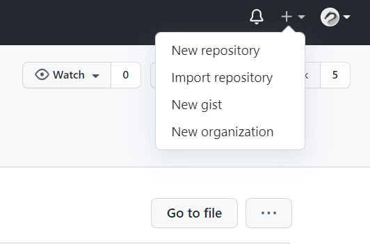
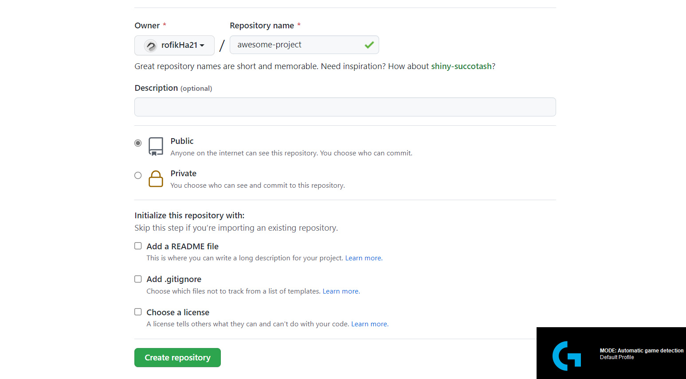
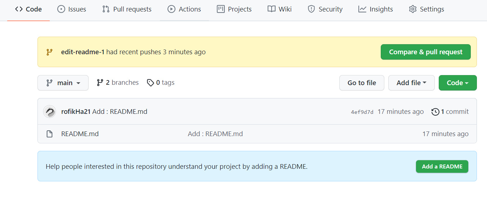
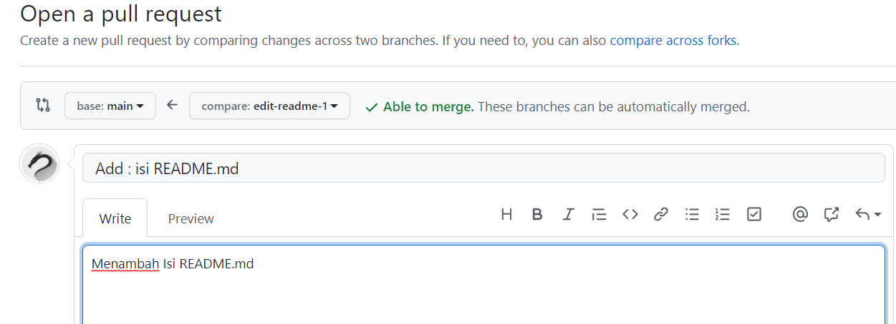
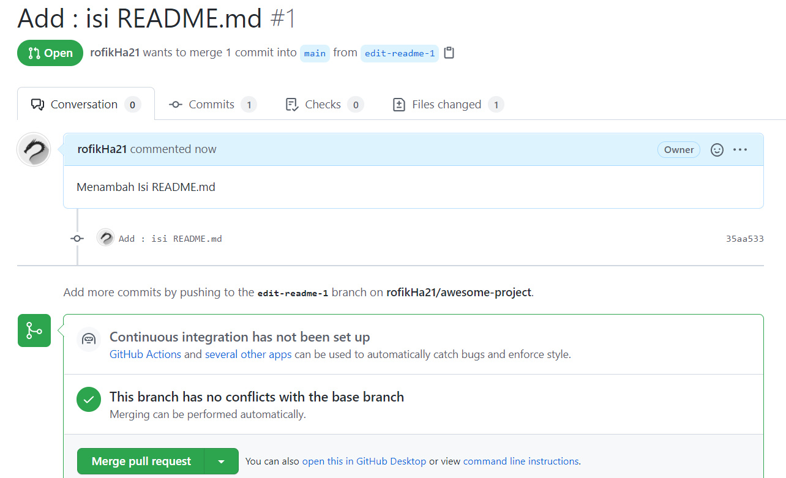

# Mengelola Repositori Sendiri

[**Halaman Awal**](README.md)

## Langkah - langkah :

### Membuat Repositori di Github

1. Membuat Repositori kosng, dengan menekan simbol **+** disamping foto profile.




2. memberi nama repositori, mengatur repositori menjadi public, dan tidak mengisi radio button




#
### Clone Repositori Github ke Local (Git)

clone merupakan teknik untuk menggandakan repositori dari github ke lokal repositori, jadi user bisa melakukan edit dokumen secara offline.

perintah clone adalah `$ git clone https://github.com/username/nama-repo`

```bash
mrofi@LUCIENNE-IPS3 MINGW64 ~
$ git clone https://github.com/rofikHa21/awesome-project
Cloning into 'awesome-project'...
warning: You appear to have cloned an empty repository.
```

jika repositori kosong maka akan muncul warning message bahwa repositori yang di clone adalah kosong.

Setiap repo memilik branch, nama branch tersebut meiliki nama default yaitu `master` namun pada saat ini banyak team menggunakan `main` saebagai nama default dari repo mereka, user bisa mengaturnya saat melakukan instalasi dengan meilih pilihan kedua. bisa dilihat di [installasi git langkah ke 6](01-install-git.md).
#

### Cara melakukan branching

```bash
mrofi@LUCIENNE-IPS3 MINGW64 ~
$ cd awesome-project

mrofi@LUCIENNE-IPS3 MINGW64 ~/awesome-project (master)
$ git branch -m main

mrofi@LUCIENNE-IPS3 MINGW64 ~/awesome-project (main)
$
```
* `cd awesome-project` merupakan perintah untuk berpindah dari folder root `~` ke folder `awesome project`. Arti `cd` itu sendiri adalah _change directory_.

* Status `(master)` adalah status kita sedang berada di branch yang bernama `master`.
* perintah `git branch -m main` adalah perintah untuk mengganti nama jadi `git branch -m <master> akan berganti ke <main>` .

#
## Mengelola Repositori

### Mengubah isi, push tanpa merging.

Biasanya jika pengguna linux / BSD akan sudah terinstall default text editor vim untuk melakukan edit file dari repositori.

untuk **vim** dapat menggunakan perintah `vim README.md`.

Apabila untuk pengguna Windows bisa menggunakan **VsCode**, untuk caranya yaitu menggunakan perintah `code README.md`.


```bash
mrofi@LUCIENNE-IPS3 MINGW64 ~/awesome-project (main)
$ code README.md
mrofi@LUCIENNE-IPS3 MINGW64 ~/awesome-project (main)
$ cat README.md

# My Awesome Project
```

* Perintah `cat` diatas adalah untuk melihat isi dari sebuah dokumen tanpa harus membuka editor.


```bash
mrofi@LUCIENNE-IPS3 MINGW64 ~/awesome-project (main)
$ git status
On branch main

No commits yet

Untracked files:
  (use "git add <file>..." to include in what will be committed)
        README.md

nothing added to commit but untracked files present (use "git add" to track)

mrofi@LUCIENNE-IPS3 MINGW64 ~/awesome-project (main)
$ git add -A
```

* perintah `git status` berguna untuk melihat status dari repo lokal apakah user melakukan perubahan pada repositori tersebut atau tidak, jika terdapat tulisan `Untracked files` berarti user belum memasukkan perubahan dari repo tersebut kedalam antrean.
 Maka akan muncul saran untuk melakukan perintah `git add` untuk menambahkan modifikasi-modifikasi apa saja yang sudah dilakukan ke repo ke dalam index/antrean, dan selanjutnya akan dilakukan _commit_.


```bash
mrofi@LUCIENNE-IPS3 MINGW64 ~/awesome-project (main)
$ git commit -m "Add: README.md"
[main (root-commit) 59eb69a] Add: README.md
 1 file changed, 1 insertion(+)
 create mode 100644 README.md

mrofi@LUCIENNE-IPS3 MINGW64 ~/awesome-project (main)
$ git push origin main
Enumerating objects: 3, done.
Counting objects: 100% (3/3), done.
Writing objects: 100% (3/3), 242 bytes | 242.00 KiB/s, done.
Total 3 (delta 0), reused 0 (delta 0), pack-reused 0
To https://github.com/rofikHa21/awesome-project
 * [new branch]      main -> main
```

* `git commit -m "<pesan commit>"` berfungsi untuk merekam perubahan - perubahan yang sudah terjadi pada repo. `-m` merujuk kepada pesan apa yang akan ditulis

* `git push origin main` adalah perintah yang berguna untuk mengupdate atau mengirim perubahan file setelah di _commit_ di local repositori ke remote repositori, untuk `origin` adalah nama default dari remote, `main` adalah nama branch.

#

### Mengubah Isi Dengan Branching dan Merging

Dengan menggunakan cara ini, setiap kali akan melakukan perubaham, perubahan itu dilakukan di komputer lokal dengan membuat suatu cabang yang nantinya digunakan untuk menampung perubahan-perubahan tersebut. Setelah itu, branch itu yang akan dikirim ke repo GitHub untuk dimintai review kemudian digabungkan `merge` ke main. Secara umum, repo yang dibuat biasanya sudah mempunyai satu branch yang disebut dengan `main`. Cara ini lebih aman, terstruktur, terkendali, dan mempunyai history yang lebih baik. Jika perubahan yang kita buat sudah terlalu kacau dan kita menyesal, maka ada cara untuk "membersihkan" repo lokal kita. Secara umum, langkahnya adalah sebagai berikut:

1. Membuat branch untuk melakukan peribahan - perubahan.
2. Melakukan perubahan - perubahan.
3. Add dan commit ke branch
4. kembali ke repo main.
5. melakukan push ke remote dari branch `edit-readme-1`.
6. membuat pull request di github
7. kemudian di merge pull request di github
8.  Merge branch ke main
9. Selesai


```bash
mrofi@LUCIENNE-IPS3 MINGW64 ~/awesome-project (main)
$ git checkout -b edit-readme-1
Switched to a new branch 'edit-readme-1'

mrofi@LUCIENNE-IPS3 MINGW64 ~/awesome-project (edit-readme-1)
$ code README.md

mrofi@LUCIENNE-IPS3 MINGW64 ~/awesome-project (edit-readme-1)
$ cat README.md
# My Awesome Project

Ini isi proyek
```
* perintah `git checkout -b edit-readme-1` untuk membuat branch baru yang bernama `edit-readme-1` .

```bash
mrofi@LUCIENNE-IPS3 MINGW64 ~/awesome-project (edit-readme-1)
$ git status
On branch edit-readme-1
Changes not staged for commit:
  (use "git add <file>..." to update what will be committed)
  (use "git restore <file>..." to discard changes in working directory)
        modified:   README.md

no changes added to commit (use "git add" and/or "git commit -a")

mrofi@LUCIENNE-IPS3 MINGW64 ~/awesome-project (edit-readme-1)
$ git add -A

mrofi@LUCIENNE-IPS3 MINGW64 ~/awesome-project (edit-readme-1)
$ git commit -m "Add: Isi README.md"
[edit-readme-1 7452706] Add: Isi README.md
 1 file changed, 3 insertions(+), 1 deletion(-)


mrofi@LUCIENNE-IPS3 MINGW64 ~/awesome-project (edit-readme-1)
$ git checkout main
Switched to branch 'main'
Your branch is based on 'origin/master', but the upstream is gone.
  (use "git branch --unset-upstream" to fixup)

mrofi@LUCIENNE-IPS3 MINGW64 ~/awesome-project (main)
$ git branch --unset-upstream
mrofi@LUCIENNE-IPS3 MINGW64 ~/awesome-project (main)
$ git status
On branch main
nothing to commit, working tree clean
```
* `git branch --unset-upstream` befungsi untuk menghilangkan informasi upstream untuk nama branch apabila tidak ada branch yang ditentukan, defaultnya adalah branch saat ini.

```bash
mrofi@LUCIENNE-IPS3 MINGW64 ~/awesome-project (main)
$ git push origin edit-readme-1
Enumerating objects: 5, done.
Counting objects: 100% (5/5), done.
Writing objects: 100% (3/3), 293 bytes | 293.00 KiB/s, done.
Total 3 (delta 0), reused 0 (delta 0), pack-reused 0
remote:
remote: Create a pull request for 'edit-readme-1' on GitHub by visiting:
remote:      https://github.com/rofikHa21/awesome-project/pull/new/edit-readme-1
remote:
To https://github.com/rofikHa21/awesome-project
 * [new branch]      edit-readme-1 -> edit-readme-1
```
* Apabila push sudah dilakukan pada branch edit-readme-1, maka kita tinggal melakukan **pull request** pada Github.

 1. akan muncul notikasi pada tab **Code**, klik **Compare and pull request**.

 

 2. megisi kolom komentar untuk pull request.
 
 

 3. ketika tidak terdeteksi konflik pada saat pull request, maka klik **Merge pull request**.

 

Setelah itu, `Confirm Merge`, branch yang kita kirimkan tadi sudah dimasukkan ke branch `main`. Setelah itu, merge di komputer lokal:

 ```bash
mrofi@LUCIENNE-IPS3 MINGW64 ~/awesome-project (main)
$ git merge edit-readme-1
Updating 59eb69a..7452706
Fast-forward
 README.md | 4 +++-
 1 file changed, 3 insertions(+), 1 deletion(-)

mrofi@LUCIENNE-IPS3 MINGW64 ~/awesome-project (main)
$ git branch
  edit-readme-1
* main

mrofi@LUCIENNE-IPS3 MINGW64 ~/awesome-project (main)
$ git branch -D edit-readme-1
Deleted branch edit-readme-1 (was 7452706).

mrofi@LUCIENNE-IPS3 MINGW64 ~/awesome-project (main)
$ git branch
* main
 ```

* Perintah `git merge` berfungsi untuk menggabungkan riwayat" perubahan dari dua cabang atau lebih, atau menggabungkan cabang-cabang tersebut.
* `git branch` berfungsi untuk mengecek daftar dari cabang yang ada.

```bash
mrofi@LUCIENNE-IPS3 MINGW64 ~/awesome-project (main)
$ git pull
remote: Enumerating objects: 1, done.
remote: Counting objects: 100% (1/1), done.
remote: Total 1 (delta 0), reused 0 (delta 0), pack-reused 0
Unpacking objects: 100% (1/1), 629 bytes | 209.00 KiB/s, done.
From https://github.com/rofikHa21/awesome-project
   59eb69a..dc8ebe7  main       -> origin/main
There is no tracking information for the current branch.
Please specify which branch you want to merge with.
See git-pull(1) for details.

    git pull <remote> <branch>

If you wish to set tracking information for this branch you can do so with:

    git branch --set-upstream-to=origin/<branch> main

mrofi@LUCIENNE-IPS3 MINGW64 ~/awesome-project (main)
$ git branch --set-upstream-to=origin/main main
Branch 'main' set up to track remote branch 'main' from 'origin'.

mrofi@LUCIENNE-IPS3 MINGW64 ~/awesome-project (main)
$ git pull
Updating 7452706..dc8ebe7
Fast-forward
```

### Sinkronasi

Ketika kita berpindah dari komputer satu ke komputer lain ketika mengelola repositori lokal, kita perlu melakukan sinkronasi agar repositori yang dikelola tidak berantakan, atau masih sama seperti saat di komputer sebelumnya. Perintah sinkronasi :

```bash
$ git pull
```

### Membatalkan Perubahan

* Langkah - Langkah : 

1. Membuat cabang / branch terlebih dahulu.
2. Melakukan perubahan - perubahan.

```bash
mrofi@LUCIENNE-IPS3 MINGW64 ~/awesome-project (main)
$ git checkout -b edit-readme-2
Switched to a new branch 'edit-readme-2'

mrofi@LUCIENNE-IPS3 MINGW64 ~/awesome-project (edit-readme-2)
$ code README.md

mrofi@LUCIENNE-IPS3 MINGW64 ~/awesome-project (edit-readme-2)
$ cat README.md
# My Awesome Project

Ini isi proyek. Jadi agak kacau nih
```
3. Kembali lagi ke cabang utama (`main`).

```bash
mrofi@LUCIENNE-IPS3 MINGW64 ~/awesome-project (edit-readme-2)
$ git checkout main
Switched to branch 'main'
M       README.md
Your branch is up to date with 'origin/main'.

mrofi@LUCIENNE-IPS3 MINGW64 ~/awesome-project (main)
$ cat readme.md
# My Awesome Project

Ini isi proyek. Jadi agak kacau nih
```
4. Apabila dokumen dirasa menjadi berantakan setelah mengalami perubahan, maka cabang tersebut bisa dihapus menggunakan `git branch -D <nama cabang>`.
5. Pastikan bahwa cabang tersebut sudah benar - benar terhapus, Untuk melihat cabang `git branch`.
```bash
mrofi@LUCIENNE-IPS3 MINGW64 ~/awesome-project (main)
$ git branch -D edit-readme-2
Deleted branch edit-readme-2 (was dc8ebe7).

mrofi@LUCIENNE-IPS3 MINGW64 ~/awesome-project (main)
$ git branch
* main

mrofi@LUCIENNE-IPS3 MINGW64 ~/awesome-project (main)
$ cat readme.md
# My Awesome Project

Ini isi proyek. Jadi agak kacau nih
```
6. Melakukan perintah `git reset --hard` untuk mengatur ulang index dan working tree. sehingga direktori akan benar-benar bersih dengan menggunakan perintah tersebut.

7. Selesai.
```bash
mrofi@LUCIENNE-IPS3 MINGW64 ~/awesome-project (main)
$ git reset --hard
HEAD is now at dc8ebe7 Merge pull request #1 from rofikHa21/edit-readme-1

mrofi@LUCIENNE-IPS3 MINGW64 ~/awesome-project (main)
$ cat README.md
# My Awesome Project

Ini isi proyek
```

### Undo Commit Terakhir

Suatu saat, mungkin kita sudah terlanjur melakukan push perubahan ke repo GitHub, setelah itu kita baru menyadari bahwa perubahan tersebut salah. Untuk itu, kita bisa melakukan `git revert`.

* Langkah - langkah : 

1. contoh dibawah ini adalah ketika melakukan perubahan pada dokumen, kemudian sudah dilakukan commit dan push ke remote repo atau github.
Kemudian akan dikembalikan ke posisi terakhir sebelum dilakukan `commit`.

```bash
mrofi@LUCIENNE-IPS3 MINGW64 ~/awesome-project (main)
$ cat README.md
# My Awesome Project

Ini isi proyek
mrofi@LUCIENNE-IPS3 MINGW64 ~/awesome-project (main)
$ git log --oneline
dc8ebe7 (HEAD -> main, origin/main) Merge pull request #1 from rofikHa21/edit-readme-1
7452706 (origin/edit-readme-1) Add: Isi README.md
59eb69a Add: README.md

mrofi@LUCIENNE-IPS3 MINGW64 ~/awesome-project (main)
$ code README.md

mrofi@LUCIENNE-IPS3 MINGW64 ~/awesome-project (main)
$ git add -A

mrofi@LUCIENNE-IPS3 MINGW64 ~/awesome-project (main)
$ git commit -m "Add: contents"
[main e5b7690] Add: contents
 1 file changed, 7 insertions(+), 1 deletion(-)

mrofi@LUCIENNE-IPS3 MINGW64 ~/awesome-project (main)
$ git push origin main
Enumerating objects: 5, done.
Counting objects: 100% (5/5), done.
Delta compression using up to 12 threads
Compressing objects: 100% (2/2), done.
Writing objects: 100% (3/3), 292 bytes | 292.00 KiB/s, done.
Total 3 (delta 0), reused 0 (delta 0), pack-reused 0
To https://github.com/rofikHa21/awesome-project
   dc8ebe7..e5b7690  main -> main

mrofi@LUCIENNE-IPS3 MINGW64 ~/awesome-project (main)
$ code README.md

mrofi@LUCIENNE-IPS3 MINGW64 ~/awesome-project (main)
$ git add -A

mrofi@LUCIENNE-IPS3 MINGW64 ~/awesome-project (main)
$ git commit -m "Add: contents - 2"
[main 16a2602] Add: contents - 2
 1 file changed, 1 insertion(+), 3 deletions(-)

mrofi@LUCIENNE-IPS3 MINGW64 ~/awesome-project (main)
$ git push origin main
Enumerating objects: 5, done.
Counting objects: 100% (5/5), done.
Delta compression using up to 12 threads
Compressing objects: 100% (2/2), done.
Writing objects: 100% (3/3), 276 bytes | 276.00 KiB/s, done.
Total 3 (delta 1), reused 0 (delta 0), pack-reused 0
remote: Resolving deltas: 100% (1/1), completed with 1 local object.
To https://github.com/rofikHa21/awesome-project
   e5b7690..16a2602  main -> main

mrofi@LUCIENNE-IPS3 MINGW64 ~/awesome-project (main)
$ cat README.md
# My Awesome Project

Ini isi proyeka

Ini isi 1

Ini isi 2
mrofi@LUCIENNE-IPS3 MINGW64 ~/awesome-project (main)
$ git status
On branch main
Your branch is up to date with 'origin/main'.

nothing to commit, working tree clean
```

2. lakukan perintah `git revert HEAD`, otomatis akan membuka teks editor kita diperintahkan untuk mengisi pesan commit untuk pembatalan.

```bash
mrofi@LUCIENNE-IPS3 MINGW64 ~/awesome-project (main)
$ git revert HEAD
hint: Waiting for your editor to close the file...
[main 2021-09-28T01:41:46.127Z] update#setState idle
[main 2021-09-28T01:42:16.144Z] update#setState checking for updates
[main 2021-09-28T01:42:16.243Z] update#setState idle
[main 5b44bc3] Revert "Add: contents - 2"
 1 file changed, 3 insertions(+), 1 deletion(-)
```
* melakukan cek status repo, dan saya melakukan beberapa perubahan lagi dengan menghapus 4 baris, kemudian melakukan push.

```bash
mrofi@LUCIENNE-IPS3 MINGW64 ~/awesome-project (main)
$ git status
On branch main
Your branch is ahead of 'origin/main' by 1 commit.
  (use "git push" to publish your local commits)

nothing to commit, working tree clean

mrofi@LUCIENNE-IPS3 MINGW64 ~/awesome-project (main)
$ git push origin main
Enumerating objects: 5, done.
Counting objects: 100% (5/5), done.
Delta compression using up to 12 threads
Compressing objects: 100% (2/2), done.
Writing objects: 100% (3/3), 322 bytes | 322.00 KiB/s, done.
Total 3 (delta 0), reused 0 (delta 0), pack-reused 0
To https://github.com/rofikHa21/awesome-project
   16a2602..5b44bc3  main -> main

mrofi@LUCIENNE-IPS3 MINGW64 ~/awesome-project (main)
$ cat README.md
# My Awesome Project

Ini isi proyeka

Ini isi 1

Ini isi 2

Ini isi 3
mrofi@LUCIENNE-IPS3 MINGW64 ~/awesome-project (main)
$ code README.md

mrofi@LUCIENNE-IPS3 MINGW64 ~/awesome-project (main)
$ git add -A

mrofi@LUCIENNE-IPS3 MINGW64 ~/awesome-project (main)
$ git commit -m "Add contents - 2"
[main 5a40228] Add contents - 2
 1 file changed, 4 deletions(-)

mrofi@LUCIENNE-IPS3 MINGW64 ~/awesome-project (main)
$ git push origin main
Enumerating objects: 5, done.
Counting objects: 100% (5/5), done.
Delta compression using up to 12 threads
Compressing objects: 100% (1/1), done.
Writing objects: 100% (3/3), 290 bytes | 290.00 KiB/s, done.
Total 3 (delta 0), reused 0 (delta 0), pack-reused 0
To https://github.com/rofikHa21/awesome-project
   5b44bc3..5a40228  main -> main

mrofi@LUCIENNE-IPS3 MINGW64 ~/awesome-project (main)
$ cat README.md
# My Awesome Project

Ini isi proyeka

Ini isi 1

```

###  Apabila `commit` sudah dilakukan, namun belum di-push ke repo github, cara membatalkannya adalah :

1. Melakukan perubahan terlebih dahulu.

```bash
mrofi@LUCIENNE-IPS3 MINGW64 ~/awesome-project (main)
$ cat README.md
# My Awesome Project

Ini isi proyeka

Ini isi 1

mrofi@LUCIENNE-IPS3 MINGW64 ~/awesome-project (main)
$ code README.md

mrofi@LUCIENNE-IPS3 MINGW64 ~/awesome-project (main)
$ git add -A

mrofi@LUCIENNE-IPS3 MINGW64 ~/awesome-project (main)
$ git commit -m "Add: isi tambahan 1"
[main 516439a] Add: isi tambahan 1
 1 file changed, 2 insertions(+)

mrofi@LUCIENNE-IPS3 MINGW64 ~/awesome-project (main)
$ git status
On branch main
Your branch is ahead of 'origin/main' by 1 commit.
  (use "git push" to publish your local commits)

nothing to commit, working tree clean

```
2. pada langkah ini saya melakukan logging untuk melihat ditempat mana saya akan melakukan `reset` untuk mengapus satu index diatasnya.

```bash
mrofi@LUCIENNE-IPS3 MINGW64 ~/awesome-project (main)
$ git log --oneline
516439a (HEAD -> main) Add: isi tambahan 1
5a40228 (origin/main) Add contents - 2
5b44bc3 Revert "Add: contents - 2"
16a2602 Add: contents - 2
e5b7690 Add: contents
dc8ebe7 Merge pull request #1 from rofikHa21/edit-readme-1
7452706 (origin/edit-readme-1) Add: Isi README.md
59eb69a Add: README.md

mrofi@LUCIENNE-IPS3 MINGW64 ~/awesome-project (main)
$ git reset --hard HEAD^
HEAD is now at 5a40228 Add contents - 2

mrofi@LUCIENNE-IPS3 MINGW64 ~/awesome-project (main)
$ git status
On branch main
Your branch is up to date with 'origin/main'.

nothing to commit, working tree clean

mrofi@LUCIENNE-IPS3 MINGW64 ~/awesome-project (main)
$ cat README.md
# My Awesome Project

Ini isi proyeka

Ini isi 1

```
### Kembali ke perubahan pada saat yang sudah lama

1. Untuk kembali ke perubahan pada saat yang sudah lama, yang perlu dilakukan adalah melakukan git revert <posisi> kemudian mengedit secara manual kemudian push ke repo.

```bash
mrofi@LUCIENNE-IPS3 MINGW64 ~/awesome-project (main)
$ cat README.md
# My Awesome Project

Ini isi proyeka

Ini isi 1

Ini isi 2

Ini isi 3
mrofi@LUCIENNE-IPS3 MINGW64 ~/awesome-project (main)
$ git log --oneline
c6ed7a2 (HEAD -> main, origin/main) Add: isi 3
bdc64f4 Add: isi 2
5a40228 Add contents - 2
5b44bc3 Revert "Add: contents - 2"
16a2602 Add: contents - 2
e5b7690 Add: contents
dc8ebe7 Merge pull request #1 from rofikHa21/edit-readme-1
7452706 (origin/edit-readme-1) Add: Isi README.md
59eb69a Add: README.md


mrofi@LUCIENNE-IPS3 MINGW64 ~/awesome-project (main)
$ git revert bdc64f4
Auto-merging README.md
CONFLICT (content): Merge conflict in README.md
error: could not revert bdc64f4... Add: isi 2
hint: after resolving the conflicts, mark the corrected paths
hint: with 'git add <paths>' or 'git rm <paths>'
hint: and commit the result with 'git commit'
```

2. Setelah itu, jika dilihat pada file, akan muncul tambahan untuk memudahkan meng-edit. File ini harus di-resolve terlebih dahulu, setelah itu baru di add dan commit:

```bash
mrofi@LUCIENNE-IPS3 MINGW64 ~/awesome-project (main|REVERTING)
$ cat readme.md
# My Awesome Project

Ini isi proyeka

Ini isi 1
<<<<<<< HEAD

Ini isi 2

Ini isi 3
=======
>>>>>>> parent of bdc64f4 (Add: isi 2)

```

3. Edit file tersebut di teks editor, setelah itu simpan. 
        harap untuk menghilangkan baris yang bertanda `<<<<<<` dan `>>>>>>>` untuk melakukan resolving.

```bash
mrofi@LUCIENNE-IPS3 MINGW64 ~/awesome-project (main|REVERTING)
$ code README.md

mrofi@LUCIENNE-IPS3 MINGW64 ~/awesome-project (main|REVERTING)
$ git status
On branch main
Your branch is up to date with 'origin/main'.

You are currently reverting commit bdc64f4.
  (fix conflicts and run "git revert --continue")
  (use "git revert --skip" to skip this patch)
  (use "git revert --abort" to cancel the revert operation)

Unmerged paths:
  (use "git restore --staged <file>..." to unstage)
  (use "git add <file>..." to mark resolution)
        both modified:   README.md

no changes added to commit (use "git add" and/or "git commit -a")
```

4. Setelah itu, lanjutkan proses revert. Saat `git revert --continue` user diperintahkan untuk mengisikan pesan revert.


```bash 

mrofi@LUCIENNE-IPS3 MINGW64 ~/awesome-project (main|REVERTING)
$ git add README.md

mrofi@LUCIENNE-IPS3 MINGW64 ~/awesome-project (main|REVERTING)
$ git status
On branch main
Your branch is up to date with 'origin/main'.

You are currently reverting commit bdc64f4.
  (all conflicts fixed: run "git revert --continue")
  (use "git revert --skip" to skip this patch)
  (use "git revert --abort" to cancel the revert operation)

Changes to be committed:
  (use "git restore --staged <file>..." to unstage)
        modified:   README.md


mrofi@LUCIENNE-IPS3 MINGW64 ~/awesome-project (main|REVERTING)
$ git revert --continue
hint: Waiting for your editor to close the file...
[main 2021-09-28T02:29:32.293Z] update#setState idle
[main 5013112] Revert "Add: isi 2"
 1 file changed, 2 insertions(+), 2 deletions(-)

mrofi@LUCIENNE-IPS3 MINGW64 ~/awesome-project (main)
$ git status
On branch main
Your branch is ahead of 'origin/main' by 1 commit.
  (use "git push" to publish your local commits)

nothing to commit, working tree clean

mrofi@LUCIENNE-IPS3 MINGW64 ~/awesome-project (main)
$ git push origin main
Enumerating objects: 5, done.
Counting objects: 100% (5/5), done.
Delta compression using up to 12 threads
Compressing objects: 100% (2/2), done.
Writing objects: 100% (3/3), 355 bytes | 355.00 KiB/s, done.
Total 3 (delta 0), reused 0 (delta 0), pack-reused 0
To https://github.com/rofikHa21/awesome-project
   c6ed7a2..5013112  main -> main
```

[**Kembali ke Halaman Utama**](README.md)